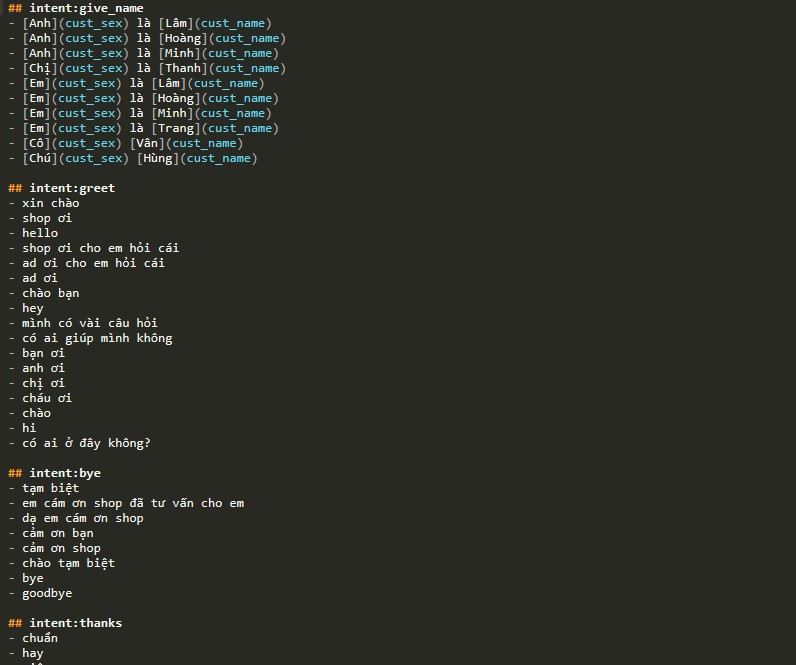
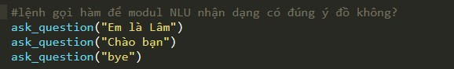
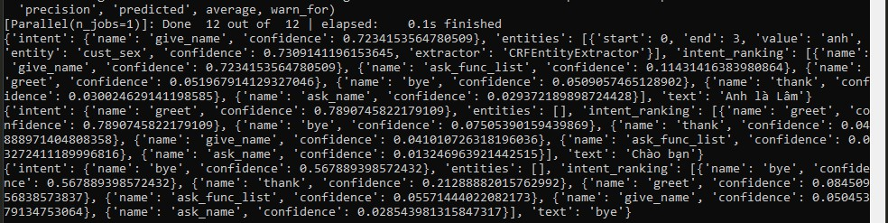
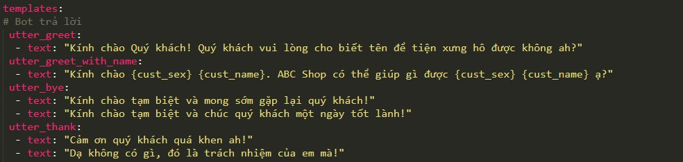
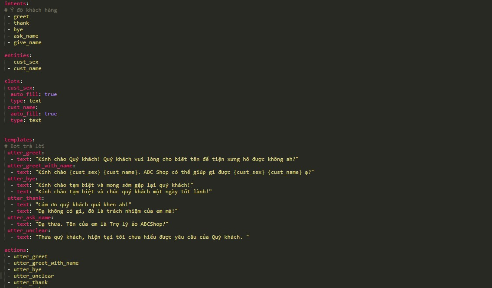
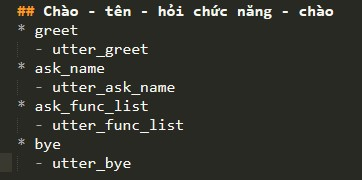
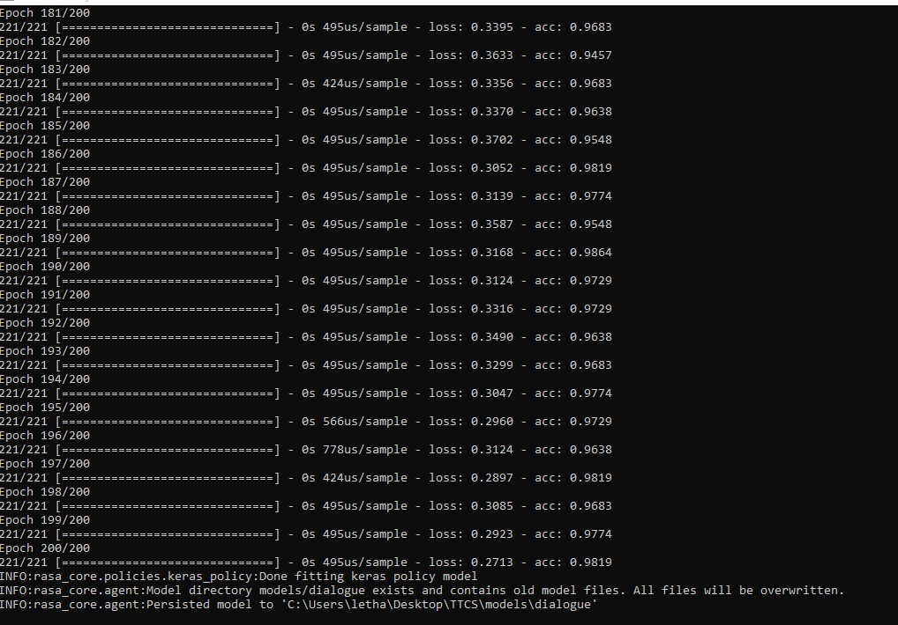
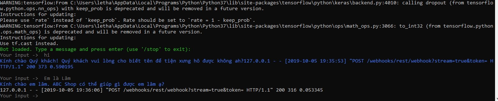

## ChatBotRasa

## Mục lục

* [Giới thiệu về RASA](#giới-thiệu-về-RASA)
* [Cài đặt thư viện](#Cài-đặt-thư-viện)
* [Nhập dữ liệu cho module NLU](#Nhập-dữ-liệu-cho-module-NLU)
* [Train và kiểm tra module NLU](#Train-và-kiểm-tra-module-NLU)
* [Train modul RASA Chatbot Core](#Train-modul-RASA-Chatbot-Core)
* [Train và test Chatbot](#Train-và-test-Chatbot])

## Yêu cầu hệ thống

 * 'Operating Systems: Linux (Ubuntu, CentOS), Mac'
    
 * 'Python 3.6+
 
 * 'Ở đây mình dùng Windowns 10, Chạy lệnh trên cửa sổ cmd, code trên sublime và sử dụng python 3.7'

# Cài đặt thư viện

  Bây giờ muốn chạy được cần cài thêm thư viện rasa_core, sklearn_crfsuite và spacy bằng lệnh:

    pip install rasa_core sklearn_crfsuite spacy rasa_nlu

  Sau đó gõ thêm lệnh sau để tải ngôn ngữ cho spacy:

    python -m spacy download en
    
# Giới thiệu về RASA

  RASA stack là một open-source AI tool và là một opensource framework, nó rất dễ dàng tuỳ chỉnh. Trên thực tế trong nhiều trường hợp, khách hàng không muốn chia sẻ dữ liệu của họ lên các dịch vụ, mà phần lớn các công cụ có sẵn là dựa trên đám mây và cung cấp phần mềm dưới dạng dịch vụ (hana, chatfuel, fptai,..). Chúng ta không thể chạy nó trong nội bộ. vì vậy, ta cần gửi dữ liệu của mình cho bên thứ ba. Với RASA, không có vấn đề như vậy. Ta có thể xây dựng, triển khai hoặc lưu trữ Rasa nội bộ trong máy chủ hoặc môi trường của mình với toàn quyền kiểm soát trên đó.
  
  RASA có 2 phần chính:
  * Rasa NLU - một thư viện để hiểu ngôn ngữ tự nhiên (NLU) thực hiện phân loại ý định và trích xuất thực thể từ đầu vào của người dùng và giúp bot hiểu người dùng đang nói gì.
  * Rasa Core - một khung chatbot với quản lý hội thoại dựa trên máy học, lấy đầu vào có cấu trúc từ NLU và dự đoán hành động tốt nhất tiếp theo bằng mô hình xác suất như mạng thần kinh LSTM.
  NLU và Core là 2 thành phần độc lập và người ta có thể sử dụng NLU mà không cần Core, và ngược lại. Mặc dù Rasa khuyên chúng ta nên sử dụng cả hai
  
  Lần nay ta sẽ triển khai mô hình chatbot ứng với đề tài cứu tìm hiểu chatbot trong tư vấn bán hàng dựa trên thư viện mã nguồn mở RASA.
  Để bắt đầu thì ta sẽ tìm hiểu về một số keywords sẽ sữ dụng trong project này
  * Intent - Intent(ý định) không là gì ngoài những gì người dùng đang hướng tới. Ví dụ: nếu người dùng nói rằng "Giới thiệu về 1 chiếc điện thoại để chơi game", ý định có thể được phân loại là "mua điện thoại"
  * Entity - Entity(thực thể) là để trích xuất thông tin hữu ích từ đầu vào của người dùng. Từ ví dụ trên, "Cần mua 1 chiếc điện thoại để chơi game", các thực thể được trích xuất sẽ là mục đích và chức năng. Mục đích - mua và chức năng - chơi game.
  * Stories - Stories(câu truyện) xác định sự tương tác mẫu giữa người dùng và chatbot theo ý định và hành động được thực hiện bởi bot.
  * Actions - Actions(hành động) về cơ bản là các hoạt động được thực hiện bởi bot hoặc yêu cầu thêm một số chi tiết để có được tất cả các thực thể hoặc tích hợp với một số API hoặc truy vấn cơ sở dữ liệu để nhận / lưu một số thông tin.
  
  Bây giờ ta đã biết một điều cơ bản, bây giờ ta sẽ tập trung chủ yếu vào Rasa hiểu ngôn ngữ tự nhiên (NLU) bào gồm trích xuất Intent Classifying & Entity và tạo ra một đầu ra có cấu trúc có thể được đưa vào Rasa Core.
  
# Rasa Natural Language Understanding (NLU)

  Như chúng ta đã tóm tắt về NLU ở trên, chúng ta cần dạy bot của chúng ta hiểu các thông điệp của chúng ta trước. Vì vậy, ta phải train mô hình NLU với các đầu vào của ta ở định dạng văn bản đơn giản và trích xuất dữ liệu có cấu trúc. Chúng ta sẽ đạt được điều này bằng cách xác định ý định và cung cấp một vài cách người dùng có thể thể hiện chúng.
  Để làm việc này, chúng ta cần xác định một số tệp. Trước tiên hãy hiểu những tập tin này
  * NLU training file: Nó chứa một số dữ liệu train về mặt đầu vào của người dùng cùng với việc ánh xạ các ý định và thực thể có trong mỗi chúng. Các ví dụ khác nhau mà bạn cung cấp, khả năng bot NLU của bạn sẽ trở nên tốt hơn.
  * Stories file: Tệp này chứa các tương tác mẫu mà người dùng và bot sẽ có. Rasa (Core) tạo ra một mô hình tương tác có thể xảy ra từ mỗi câu chuyện.
  * Domain file: Tệp này liệt kê tất cả ý định(intents), thực thể(entities), hành động(actions), mẫu(templates) và một số thông tin khác. Chúng ta sẽ đến chi tiết về tệp này khi tới phần Rasa Core.

## Nhập dữ liệu cho module NLU

  Sau khi đã cài đặt đầy đủ các package cần thiết, thì ta bắt đầu tạo cấu trúc dự án. Ta đặt tên cho dự án là ChatBotRaSa và đây là tên thư mục dự án cơ sở. Đối với các file training/data, ta tạo một thư mục data trong thư mục ChatBotRaSa và tạo tệp training nlu.md.
  
  hình creatchat
  
  Trong modul NLU có khái niệm intent - ý đồ của khách hàng. Ví dụ nếu KH Chat "Cần mua điện thoại iphone" hay "mua điện thoại" thì tuy 2 câu khác nhau nhưng cùng một ý đồ - intent là "mua_điên_thoại". Các dữ liệu được cung cấp sẽ giúp đào tạo bot. Nhiều dữ liệu hơn sẽ giúp tạo bot tốt hơn. Mỗi intent có tầm từ 10 câu trở lên để đạt được kết quả cao nhất
Ở đây mình đã nhập dữ liệu trong file nlu.md và sẽ có cấu trúc như sau

  Trong đó :
  
   * intent: greet là ý đồ của khách hàng là greet(chào hỏi)
   * Các câu còn bên dưới là các mẫu câu chat chúng ta quy ước vào intent/ý đồ chào hỏi. Mình cũng có thể thêm nhiêu câu như:"Chào","Alo",...

  

# Train và kiểm tra module NLU
  Module NLU cần phải được kiểm tra kỹ trước khi làm các bước tiếp theo bởi vì nếu ta hiểu sai ý đồ/intent của khách hàng thì các bước sau đều sai cả

  Mở file nlu_model.py,  nhìn ở dòng cuối có các lệnh gọi hàm ask_question, mục đích là để chúng ta truyền thử các câu hỏi của khách hàng vào xem modul NLU có đoán đúng ý đồ không:

  Với những câu như trên là đang thử "Chào bạn", "Anh là Lâm", "bye" và "điện thoại 2gb ram" xem modul NLU nhận dạng như nào. Có thể chạy file nlu_model.py bằng IDE lập trình (Pycharm, VS…) hoặc gõ lệnh python nlu_model.py và nhìn trên màn hình kết quả có dạng như sau:

  Chúng ta để ý những con số trên, với những con số ứng với mỗi intent
   * Với câu "Chào bạn", máy đã nhận đúng là intent greet vơi độ tin tưởng là 0.789
   * Với câu "bye", máy đã nhận đúng là intent bye vơi độ tin tưởng là 0.567

  Vậy nên, với độ tin tưởng càng lớn mà nghĩa của câu gần đúng với intent đã đặt thì modul NLU đã đoán đúng ý đồ

# Train modul RASA Chatbot Core
 
  Như vậy, modul NLU đã xong, máy đã có thể hiểu được chúng ta nói gì, bây giờ đên phần thứ 2, train cho RASA Chatbot phản ứng lại những gì khách hàng nói

  Ở phần này có 2 file cần hiểu đó là domain.yml và stories.md của RASA Chatbot

## File domain.yml

  Nếu như file nlu.md là để lưu các câu nói của khách hàng ứng với ý đồ nào thì file domain.yml là định nghĩa các câu phản hồi của bot với các ý đồ của khách hàng (gọi là các utter, ứng với intent ở trên)

  File domain.yml sẽ có 3 phần chính
   * Phần 1: Liệt kê lại các intent của khách hàng
   * Phần 2: Phần templates, cũng là phần quang trọng. Phần này liệt kê các utter phản hồi lại các intent của khách hàng. Mỗi utter có thể định nghĩa nhiều câu text và bot sẽ chọn random các câu text này để phản hồi. Như bên dưới là utter_greet (để chào lại khách hàng khi khách chào mình) chỉ có 1 text nhưng utter_bye (để chào tạm biệt khách khi khách tạm biệt mình) thì có 2 câu text. Trong phần này cần chú ý có một utter đặc biệt là utter_unclear, utter này sẽ được gọi khi máy không hiểu được ý của người dùng, khi đó máy sẽ nói các câu dạng như “Thưa quý khách, hiện tại tôi chưa hiểu được yêu cầu của Quý khách” thay vì im tịt.
 
 
 
   * Phần 3: Liệt kê lại các utter có trong phần 2
 
 
 
 ## File stories.md
 
  File này như một file kể chuyện, để kết nối giữa intent và utter. Nếu như nlu.md định nghĩa intent, domain.yml định nghĩa utter. Nhưng máy đâu có hiểu là intent nào thì dùng utter nào đâu. Và đó là lý do phải có thêm file stories.md để ghép nối.
 
  File này có dạng như sau
  
  
  
  Như đoạn trên là định nghĩa 1 đoạn chat giữa người và máy. Người vào chào hỏi, máy chào lại, rồi người hỏi tên, máy trả lời, rồi hỏi tiếp các món máy có thể làm, rồi tạm biệt…

  Chúng ta cố gắng nghĩ ra càng nhiều đoạn hội thoại càng tốt, thì máy sẽ càng thông minh khi chat và nội dung chat mềm dẻo hơn. Có thể xem thêm nội dung trong file stories.md trong thư mục dự án

# Train và test Chatbot

  Với những file đã chuẩn bị đây đủ, chúng ta có thể bắt đầu train cho Bot

  Ta mở file train_dialog.py và chạy file bằng IDE lập trình (Pycharm, VS…) hoặc gõ lệnh python train_dialog.py, sau khi máy chạy hết 200 Epoch và nhìn trên màn hình kết quả có dạng như sau:

 

  Sau khi train xong thì chúng ta chạy tiếp file test_dialog.py, nó sẽ hiện ra một cửa sổ chat và chúng ta có thể chat với bot để test.

 Và đây là kết quả

 

